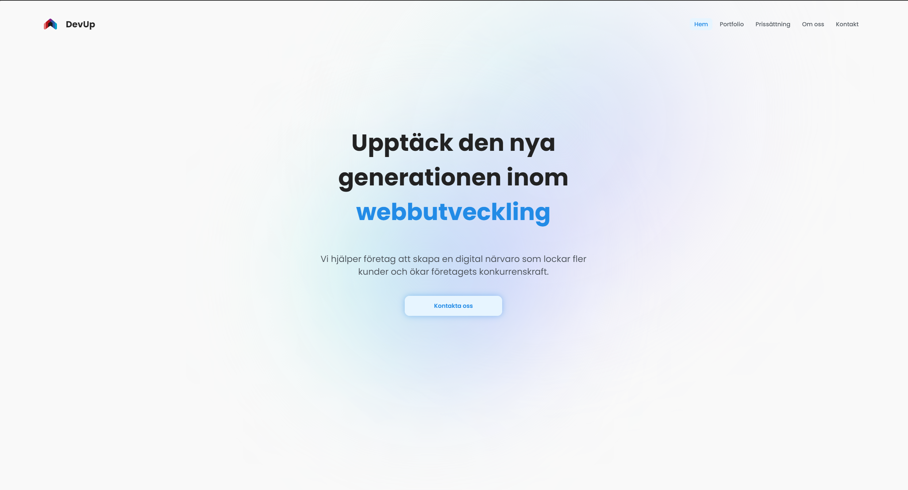

<!-- PROJECT LOGO -->
 

  

  <h3 align="center">Devup</h3>

  

    React & Vite site for web development agency
     
     
    <a href="https://github.com/eliasakesson/devup"><strong>Explore the docs »</strong></a>
     
     
    <a href="https://www.devupweb.vercel.app">View App</a>
  

<!-- ABOUT THE PROJECT -->
## About The Project

  
  

### Devup

Devup is a static site for a web development agency built using React and Vite. The app is programmed in Typescript, and is meant to attract customers to the web development agency.

Features
* UI/UX design
* Scroll animations
* Contact forms

(<a href="#readme-top">back to top</a>)

### Built With

Here are the main frameworks and libraries i've used for this project:

* ![Vite][Vite]
* ![React][React.js]
* ![Typescript][Typescript]
* ![Sass][Sass]

(<a href="#readme-top">back to top</a>)

<!-- LICENSE -->
## License

Distributed under the MIT License. See `LICENSE.txt` for more information.

(<a href="#readme-top">back to top</a>)

<!-- CONTACT -->
## Contact

.

(<a href="#readme-top">back to top</a>)

<!-- ACKNOWLEDGMENTS -->
## Acknowledgments

Here are a few of the libraries and tools i used for this project:

* [Img Shields](https://shields.io)
* [Font Awesome](https://fontawesome.com)
* [React Icons](https://react-icons.github.io/react-icons/search)

(<a href="#readme-top">back to top</a>)

<!-- MARKDOWN LINKS & IMAGES -->
[logo]: public/images/logo.png
[product-screenshot]: public/images/home-page.png
[Vite]: https://img.shields.io/badge/vite-%23646CFF.svg?style=for-the-badge&logo=vite&logoColor=white
[React.js]: https://img.shields.io/badge/React-20232A?style=for-the-badge&logo=react&logoColor=61DAFB
[Typescript]: https://img.shields.io/badge/typescript-%23007ACC.svg?style=for-the-badge&logo=typescript&logoColor=white
[Sass]: https://img.shields.io/badge/SASS-hotpink.svg?style=for-the-badge&logo=SASS&logoColor=white
